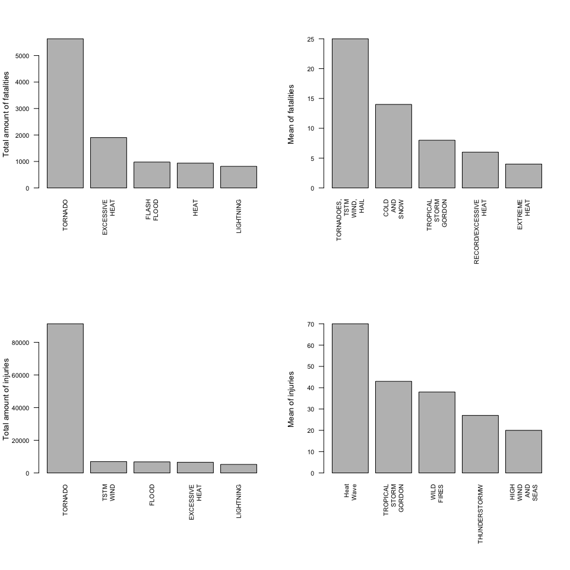
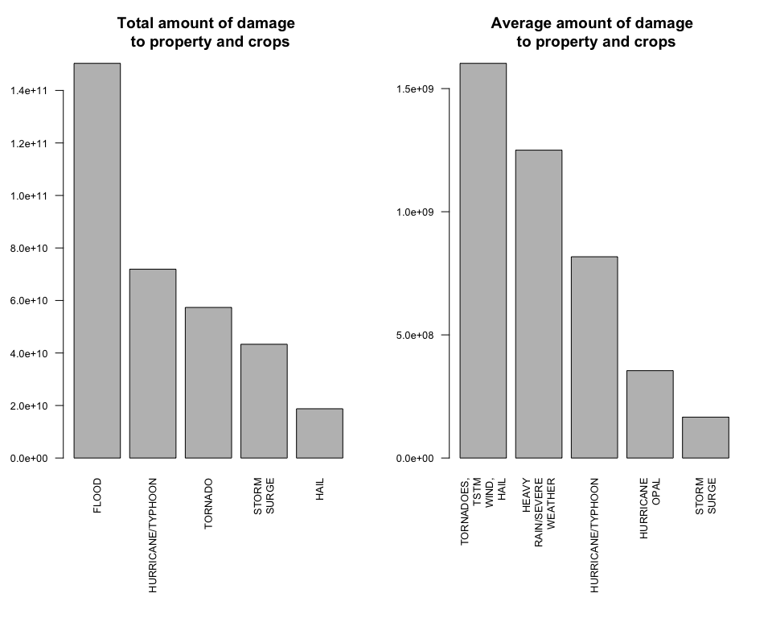

# Severe weather events,  population health and economic consequences
Chahid Azarkan  

#Synopsis
In this report the fatalities, injuries and the impact on the economy of severe weather events in the U.S. are analyzed. In order to do this analysis, data from the U.S. National Oceanic and Atmospheric Administration's (NOAA) storm database is used.

The results of this analyis can be found at the bottom of this report.

#Introduction
Severe weather events, like storms, can cause problems in different communites and municipalities to both public health and the economy. Preventing the effect of severe weather events is a key concern for the federal, state and municipal governments.

In this analysis data is used from the U.S. National Oceanic and Atmospheric Administration's (NOAA) storm database. In this database characteristics are tracked of major weather events in the United States, including when and where they occur, as well as estimates of any fatalities, injuries, and property damage.

This analysis is answers the following two questions:

1. Across the United States, which types of events are most harmful with respect to population health?
2. Across the United States, which types of events have the greatest economic consequences?


#Data processing
The following libraries and functions are used for this analyis:

```r
# Libraries
library(dplyr)
library(data.table)
library(xtable)
library(ggplot2)


# function

wrap.it <- function(x, len)
{ 
  sapply(x, function(y) paste(strwrap(y, len), 
                              collapse = "\n"), 
         USE.NAMES = FALSE)
}

wrap.labels <- function(x, len)
{
  if (is.list(x))
  {
    lapply(x, wrap.it, len)
  } else {
    wrap.it(x, len)
  }
}
```


To be able to carry out the analysis the data needs to be donwloaded and imported.

```r
fileUrl <- "https://d396qusza40orc.cloudfront.net/repdata%2Fdata%2FStormData.csv.bz2"
temp <- tempfile()
download.file(fileUrl,temp, method="curl")
weather <- fread(sprintf("bzcat %s | tr -d '\\000'", temp, verbose=TRUE))
```


Read 9.3% of 967216 rows
Read 35.2% of 967216 rows
Read 54.8% of 967216 rows
Read 75.5% of 967216 rows
Read 83.7% of 967216 rows
Read 902297 rows and 37 (of 37) columns from 0.523 GB file in 00:00:08

```r
unlink(temp)
```

Not all imported data is needed for the analysis, therefore a few columns need to be selected and named.

```r
data <- data.table(weather$STATE__, weather$BGN_DATE, weather$COUNTY, weather$STATE, weather$EVTYPE, weather$FATALITIES, weather$INJURIES, weather$PROPDMG, weather$PROPDMGEXP, weather$CROPDMG, weather$CROPDMGEXP, weather$REFNUM)

colnames(data) <- c("state.id", "date", "county", "state", "evtype", "fatalities", "injuries", "propdmg", "propdmg.exp", "cropdmg", "cropdmg.exp", "id")
```

To be able to make the right calculations, the data needs to be grouped by event type.


```r
datab <- group_by(data, evtype)
```


#Data analysis
This analysis needs to answer the following two questions:

1. Across the United States, which types of events are most harmful with respect to population health?
2. Across the United States, which types of events have the greatest economic consequences?

## Most harmful events in respect to population health
To be able to determine the most harmful events in respect to population health we need to calculate the sum of the effect of certain event types on fatalities and injuries.

Furthermore, the mean value for both fatalities and injuries needs to be determined. This allows for a correction of the amount of occurence of an event type.  

```r
sum.fatalities <- arrange(summarise(datab, sum.of.fatalities=sum(fatalities, na.rm = TRUE)), desc(sum.of.fatalities))
sum.injuries <- arrange(summarise(datab, sum.of.injuries=sum(injuries, na.rm = TRUE)), desc(sum.of.injuries))
mean.fatalities <- arrange(summarise(datab, mean.of.fatalities=mean(fatalities, na.rm = TRUE)), desc(mean.of.fatalities))
mean.fatalities$mean.of.fatalities <- round(mean.fatalities$mean.of.fatalities, digits=0)
mean.injuries <- arrange(summarise(datab, mean.of.injuries=mean(injuries, na.rm = TRUE)), desc(mean.of.injuries))
mean.injuries$mean.of.injuries <- round(mean.injuries$mean.of.injuries, digits=0)
```

Below the top 5 of event types, that resulted in the highest fatalities, is given.

```r
mostfatalities <- sum.fatalities[1:5,]
knitr::kable(mostfatalities, col.names=c("Event type", "Total number of fatalities"), format ="html")
```

<table>
 <thead>
  <tr>
   <th style="text-align:left;"> Event type </th>
   <th style="text-align:right;"> Total number of fatalities </th>
  </tr>
 </thead>
<tbody>
  <tr>
   <td style="text-align:left;"> TORNADO </td>
   <td style="text-align:right;"> 5633 </td>
  </tr>
  <tr>
   <td style="text-align:left;"> EXCESSIVE HEAT </td>
   <td style="text-align:right;"> 1903 </td>
  </tr>
  <tr>
   <td style="text-align:left;"> FLASH FLOOD </td>
   <td style="text-align:right;"> 978 </td>
  </tr>
  <tr>
   <td style="text-align:left;"> HEAT </td>
   <td style="text-align:right;"> 937 </td>
  </tr>
  <tr>
   <td style="text-align:left;"> LIGHTNING </td>
   <td style="text-align:right;"> 816 </td>
  </tr>
</tbody>
</table>


Below the top 5 of event types, that resulted in the highest mean fatalities, is given.

```r
mean.mostfatalities <- mean.fatalities[1:5,]
knitr::kable(mean.mostfatalities, col.names= c("Event type", "Mean number of fatalities"), format ="html")
```

<table>
 <thead>
  <tr>
   <th style="text-align:left;"> Event type </th>
   <th style="text-align:right;"> Mean number of fatalities </th>
  </tr>
 </thead>
<tbody>
  <tr>
   <td style="text-align:left;"> TORNADOES, TSTM WIND, HAIL </td>
   <td style="text-align:right;"> 25 </td>
  </tr>
  <tr>
   <td style="text-align:left;"> COLD AND SNOW </td>
   <td style="text-align:right;"> 14 </td>
  </tr>
  <tr>
   <td style="text-align:left;"> TROPICAL STORM GORDON </td>
   <td style="text-align:right;"> 8 </td>
  </tr>
  <tr>
   <td style="text-align:left;"> RECORD/EXCESSIVE HEAT </td>
   <td style="text-align:right;"> 6 </td>
  </tr>
  <tr>
   <td style="text-align:left;"> EXTREME HEAT </td>
   <td style="text-align:right;"> 4 </td>
  </tr>
</tbody>
</table>


Below the top 5 of event types, that resulted in the highest injuries, is given.

```r
mostinjuries <- sum.injuries[1:5,]
knitr::kable(mostinjuries, col.names=c("Event type", "Total number of injuries"), format ="html")
```

<table>
 <thead>
  <tr>
   <th style="text-align:left;"> Event type </th>
   <th style="text-align:right;"> Total number of injuries </th>
  </tr>
 </thead>
<tbody>
  <tr>
   <td style="text-align:left;"> TORNADO </td>
   <td style="text-align:right;"> 91346 </td>
  </tr>
  <tr>
   <td style="text-align:left;"> TSTM WIND </td>
   <td style="text-align:right;"> 6957 </td>
  </tr>
  <tr>
   <td style="text-align:left;"> FLOOD </td>
   <td style="text-align:right;"> 6789 </td>
  </tr>
  <tr>
   <td style="text-align:left;"> EXCESSIVE HEAT </td>
   <td style="text-align:right;"> 6525 </td>
  </tr>
  <tr>
   <td style="text-align:left;"> LIGHTNING </td>
   <td style="text-align:right;"> 5230 </td>
  </tr>
</tbody>
</table>


Below the top 5 of event types, that resulted in the highest mean injuries, is given.

```r
mean.mostinjuries <- mean.injuries[1:5,]
knitr::kable(mean.mostinjuries, col.names=c("Event type", "Mean number of injuries"), format ="html")
```

<table>
 <thead>
  <tr>
   <th style="text-align:left;"> Event type </th>
   <th style="text-align:right;"> Mean number of injuries </th>
  </tr>
 </thead>
<tbody>
  <tr>
   <td style="text-align:left;"> Heat Wave </td>
   <td style="text-align:right;"> 70 </td>
  </tr>
  <tr>
   <td style="text-align:left;"> TROPICAL STORM GORDON </td>
   <td style="text-align:right;"> 43 </td>
  </tr>
  <tr>
   <td style="text-align:left;"> WILD FIRES </td>
   <td style="text-align:right;"> 38 </td>
  </tr>
  <tr>
   <td style="text-align:left;"> THUNDERSTORMW </td>
   <td style="text-align:right;"> 27 </td>
  </tr>
  <tr>
   <td style="text-align:left;"> HIGH WIND AND SEAS </td>
   <td style="text-align:right;"> 20 </td>
  </tr>
</tbody>
</table>

Below a figure is given which shows the above stated tables in a barplot.

```r
par(mfrow=c(2,2), las = 2, mar = c(10,4,4,2) + 0.1)
barplot(height=mostfatalities$sum.of.fatalities, names.arg=wrap.labels(mostfatalities$evtype, 5), cex.axis=.8, cex.names=.8, xlab=" ", ylab = "Total amount of fatalities")
barplot(height=mean.mostfatalities$mean.of.fatalities, names.arg = wrap.labels(mean.mostfatalities$evtype,5), cex.axis=.8, cex.names=.8, xlab=" ", ylab = "Mean of fatalities")
barplot(height=mostinjuries$sum.of.injuries, names.arg=wrap.labels(mostinjuries$evtype, 5), cex.axis=.8, cex.names=.8, xlab=" ", ylab = "Total amount of injuries")
barplot(height = mean.mostinjuries$mean.of.injuries, names.arg = wrap.labels(mean.mostinjuries$evtype, 5), cex.axis=.8, cex.names=.8, xlab=" ", ylab = "Mean of injuries")
```



## Most harmful events  events have the greatest economic consequences?
To be able to determine the most harmful events in respect to the economy, we need to calculate the sum of the effect of certain event types on the economy. Economy is defined as both damages to properties and crops.

Furthermore, the mean value for damages to properties and crops needs to be determined. This allows for a correction of the amount of occurence of an event type. 

The property and crop damage data that is available are estimates, that are multipled using a letter. To be able to calculate the total amount of damage to both properties and crops, we need to change the letter to a number and multiply that with the amount that is given in the database.


```r
dataeco <- data.frame(as.character(datab$evtype), datab$cropdmg, datab$cropdmg.exp, datab$propdmg, datab$propdmg.exp)
colnames(dataeco) <- c("evtype", "cropdmg", "cropdmg.exp", "propdmg", "propdmg.exp")

dataeco <- data.table(dataeco)
dataeco$evtype <- as.character(data$evtype)

dataeco$cropdmg.exp.n <- 0
dataeco$cropdmg.exp.n[grep("[?+-012345678]", dataeco$cropdmg.exp, ignore.case=TRUE)] <- 1
dataeco$cropdmg.exp.n[grep("[h]", dataeco$cropdmg.exp, ignore.case=TRUE)] <- 100
dataeco$cropdmg.exp.n[grep("[k]", dataeco$cropdmg.exp, ignore.case=TRUE)] <- 1e+03
dataeco$cropdmg.exp.n[grep("[m]", dataeco$cropdmg.exp, ignore.case=TRUE)] <- 1e+06
dataeco$cropdmg.exp.n[grep("[b]", dataeco$cropdmg.exp, ignore.case=TRUE)] <- 1e+09

dataeco$propdmg.exp.n <- 0
dataeco$propdmg.exp.n[grep("[?+-012345678]", dataeco$propdmg.exp, ignore.case=TRUE)] <- 100
dataeco$propdmg.exp.n[grep("[k]", dataeco$propdmg.exp, ignore.case=TRUE)] <- 1e+03
dataeco$propdmg.exp.n[grep("[m]", dataeco$propdmg.exp, ignore.case=TRUE)] <- 1e+06
dataeco$propdmg.exp.n[grep("[b]", dataeco$propdmg.exp, ignore.case=TRUE)] <- 1e+09

dataeco$cropdmg.m <- dataeco$cropdmg * dataeco$cropdmg.exp.n
dataeco$propdmg.m <- dataeco$propdmg * dataeco$propdmg.exp.n

dataeco$croppropdmg <- dataeco$cropdmg.m+dataeco$propdmg.m

dataeco <- group_by(dataeco, evtype)

sum.crop.dataeco <- summarise(dataeco, sum.of.c.damage=sum(cropdmg.m, na.rm=TRUE))
sum.crop.dataeco$sum.of.c.damage <- round(sum.crop.dataeco$sum.of.c.damage, digits=0)

mean.crop.dataeco <- summarise(dataeco, mean.of.c.damage=mean(cropdmg.m, na.rm=TRUE))
mean.crop.dataeco$mean.of.c.damage <- round(mean.crop.dataeco$mean.of.c.damage, digits=0)


sum.prop.dataeco <- summarise(dataeco, sum.of.p.damage=sum(propdmg.m, na.rm=TRUE))
sum.prop.dataeco$sum.of.p.damage <- round(sum.prop.dataeco$sum.of.p.damage, digits=0)

mean.prop.dataeco <- summarise(dataeco, mean.of.p.damage=mean(propdmg.m, na.rm=TRUE))
mean.prop.dataeco$mean.of.p.damage <- round(mean.prop.dataeco$mean.of.p.damage, digits=0)

sum.t.dataeco <- summarise(dataeco, sum.of.t.damage=sum(croppropdmg, na.rm=TRUE))
sum.t.dataeco$sum.of.t.damage <- round(sum.t.dataeco$sum.of.t.damage, digits=0)

mean.t.dataeco <- summarise(dataeco, mean.of.t.damage=mean(croppropdmg, na.rm=TRUE))
mean.t.dataeco$mean.of.t.damage <- round(mean.t.dataeco$mean.of.t.damage, digits=0)
```

Now that the sum of property, crop and total damage per event type are available, we can determin the top 5.


```r
sum.eco <- merge(sum.t.dataeco, sum.prop.dataeco, by="evtype")
sum.eco <- merge(sum.eco, sum.crop.dataeco, by="evtype")
sum.eco <- arrange(sum.eco, desc(sum.of.t.damage))

mean.eco <- merge(mean.t.dataeco, mean.prop.dataeco, by="evtype")
mean.eco <- merge(mean.eco, mean.crop.dataeco, by="evtype")
mean.eco <- arrange(mean.eco, desc(mean.of.t.damage))
```

The top 5 of the (in total) most harmful event types for the economy is presented in the table below (all amounts are in U.S. dollars).

```r
sum.most.eco <- sum.eco[1:5]
knitr::kable(sum.most.eco, col.names=c("Event type", "Total amount of damage \n to both property and crops", "Total amount of \n property damage", "Total amount of \n crop damage"), format ="html")
```

<table>
 <thead>
  <tr>
   <th style="text-align:left;"> Event type </th>
   <th style="text-align:right;"> Total amount of damage 
 to both property and crops </th>
   <th style="text-align:right;"> Total amount of 
 property damage </th>
   <th style="text-align:right;"> Total amount of 
 crop damage </th>
  </tr>
 </thead>
<tbody>
  <tr>
   <td style="text-align:left;"> FLOOD </td>
   <td style="text-align:right;"> 150319678250 </td>
   <td style="text-align:right;"> 144657709800 </td>
   <td style="text-align:right;"> 5661968450 </td>
  </tr>
  <tr>
   <td style="text-align:left;"> HURRICANE/TYPHOON </td>
   <td style="text-align:right;"> 71913712800 </td>
   <td style="text-align:right;"> 69305840000 </td>
   <td style="text-align:right;"> 2607872800 </td>
  </tr>
  <tr>
   <td style="text-align:left;"> TORNADO </td>
   <td style="text-align:right;"> 57352143320 </td>
   <td style="text-align:right;"> 56937190050 </td>
   <td style="text-align:right;"> 414953270 </td>
  </tr>
  <tr>
   <td style="text-align:left;"> STORM SURGE </td>
   <td style="text-align:right;"> 43323541000 </td>
   <td style="text-align:right;"> 43323536000 </td>
   <td style="text-align:right;"> 5000 </td>
  </tr>
  <tr>
   <td style="text-align:left;"> HAIL </td>
   <td style="text-align:right;"> 18758247760 </td>
   <td style="text-align:right;"> 15732293290 </td>
   <td style="text-align:right;"> 3025954470 </td>
  </tr>
</tbody>
</table>

The top 5 of the (on average) most harmful event types for the economy is presented in the table below (all amounts are in U.S. dollars).

```r
mean.most.eco <- mean.eco[1:5]
knitr::kable(mean.most.eco, col.names=c("Event type", "Average amount of damage \n to both property and crops", "Average amount of \n property damage", "Average amount of \n crop damage"), format ="html")
```

<table>
 <thead>
  <tr>
   <th style="text-align:left;"> Event type </th>
   <th style="text-align:right;"> Average amount of damage 
 to both property and crops </th>
   <th style="text-align:right;"> Average amount of 
 property damage </th>
   <th style="text-align:right;"> Average amount of 
 crop damage </th>
  </tr>
 </thead>
<tbody>
  <tr>
   <td style="text-align:left;"> TORNADOES, TSTM WIND, HAIL </td>
   <td style="text-align:right;"> 1602500000 </td>
   <td style="text-align:right;"> 1600000000 </td>
   <td style="text-align:right;"> 2500000 </td>
  </tr>
  <tr>
   <td style="text-align:left;"> HEAVY RAIN/SEVERE WEATHER </td>
   <td style="text-align:right;"> 1250000000 </td>
   <td style="text-align:right;"> 1250000000 </td>
   <td style="text-align:right;"> 0 </td>
  </tr>
  <tr>
   <td style="text-align:left;"> HURRICANE/TYPHOON </td>
   <td style="text-align:right;"> 817201282 </td>
   <td style="text-align:right;"> 787566364 </td>
   <td style="text-align:right;"> 29634918 </td>
  </tr>
  <tr>
   <td style="text-align:left;"> HURRICANE OPAL </td>
   <td style="text-align:right;"> 354649556 </td>
   <td style="text-align:right;"> 352538444 </td>
   <td style="text-align:right;"> 2111111 </td>
  </tr>
  <tr>
   <td style="text-align:left;"> STORM SURGE </td>
   <td style="text-align:right;"> 165990579 </td>
   <td style="text-align:right;"> 165990559 </td>
   <td style="text-align:right;"> 19 </td>
  </tr>
</tbody>
</table>

Below a figure is given which shows the above stated tabels in a barplot.

```r
par(mfcol=c(1,2), las = 2, mar = c(10,4,4,2) + 0.1)
barplot(height=sum.most.eco$sum.of.t.damage, names.arg = wrap.labels(sum.most.eco$evtype,4), cex.axis=.8, cex.names=.8, xlab=" ", main = "Total amount of damage \n to property and crops")

barplot(height=mean.most.eco$mean.of.t.damage, names.arg=wrap.labels(mean.most.eco$evtype,4), cex.axis=.8, cex.names=.8, xlab=" ", main = "Average amount of damage \n to property and crops")
```



#Results
1. The event type that has resulted in the **most deaths** is: *tornado*.
2. The event type that in **average** results in the most **deaths** is: *tornadoes, tstm wind, hail*.
1. The event type that has resulted in the **most injuries** is: *tornado*.
2. The event type that in **average** results in the most **injuries** is: *heat wave*. 
1. The event type that has resulted in the **most damage** to both **property and crops** is: *flood*.
2. The event type that in **average** results in the most **damage** to both **property and crops** is: *tornadoes, tstm wind, hail*. 


